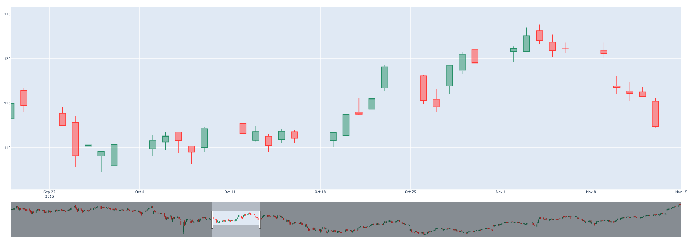

## Autoscale y-axis of candlestick when using rangeslider

When using Plotly Python to plot candlestick charts for stock prices, one may encounter the issue that the y-axis does not autoscale when using the rangeslider to select a specific range of data. This code snippet provides a solution by utilizing a Dash callback for relayout, which allows for obtaining the range selected by the user and adjust the y-axis accordingly.

```Python
app.layout = html.Div(
    [
        dcc.Graph(id="stock-chart", figure=stockfig, style={"width": "1300px"}),
        html.Div(id="range-output"),
    ]
)


def find_min_max(df, start_date, end_date):
    df["Date"] = pd.to_datetime(df["Date"])
    filtered_df = df[(df["Date"] >= start_date) & (df["Date"] <= end_date)]
    # print(filtered_df)
    min_values = min(list(filtered_df[["Open", "High", "Low", "Close"]].min()))
    max_values = max(list(filtered_df[["Open", "High", "Low", "Close"]].max()))
    # print(min_values, max_values)
    return min_values, max_values


@app.callback(Output("stock-chart", "figure"), [Input("stock-chart", "relayoutData")])
def display_relayout_data(relayoutData):
    global stockfig
    start = end = 0

    if not relayoutData:
        raise PreventUpdate

    if relayoutData.get("xaxis.range", False):
        start = relayoutData["xaxis.range"][0]
        end = relayoutData["xaxis.range"][1]
    elif relayoutData.get("xaxis.range[0]", False):
        start = relayoutData["xaxis.range[0]"]
        end = relayoutData["xaxis.range[1]"]

    if start != 0:
        print("Start: ", start.split(" ")[0])
        print("End: ", end.split(" ")[0])
        start = start.split(" ")[0]
        end = end.split(" ")[0]

        ymin, ymax = find_min_max(df, start, end)

        diff = ymax - ymin

        ymin -= min(diff * 0.2, 2)
        ymax += min(diff * 0.2, 2)

        stockfig.update_layout(
            xaxis_autorange=False,
            yaxis_autorange=False,
            xaxis_range=[start, end],
            yaxis_range=[ymin, ymax],
        )

        return stockfig
    else:
        raise PreventUpdate
```

## Demo

Run autoscale-candlestick.py to see the demo.
